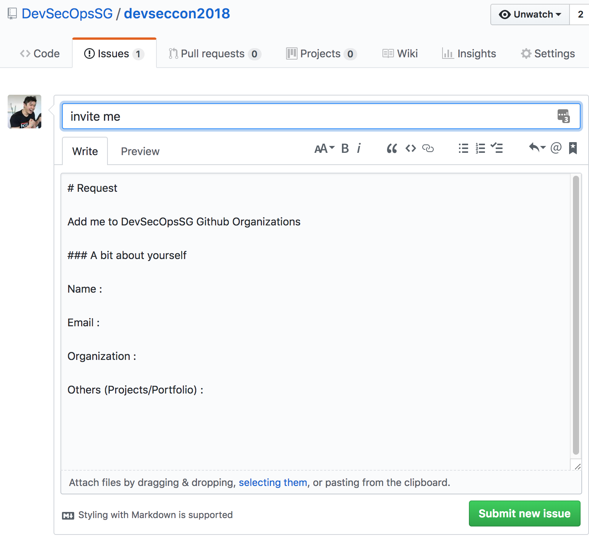

# devseccon2018

This project is for DevSecCon2018 workshop

## Pre-requisite (Do this right NOW)

1. For access to services, please sign up / log in to GitHub

2. Create an issue in https://github.com/DevSecOpsSG/devseccon2018 project with your GitHub account so I can send an invite to your user

* 

3. Join the https://github.com/DevSecOpsSG organization from the email invite

```
Membership to https://github.com/DevSecOpsSG allows access to the Lab Jenkins and Vault
For Jenkins, no further action required
For Vault, generate a GitHub personal access token to login -> Follow Steps 1-9 on: https://help.github.com/articles/creating-a-personal-access-token-for-the-command-line
Scopes define the access for personal tokens: Check “read:org” only
```

Presentation Slides:

 * https://docs.google.com/presentation/d/1eW6oMxEmhLJm6tVkAP3iHmb_AVEuZWZ7GMsIYFMHhqo/edit?usp=sharing

Lab Slides:

 * https://docs.google.com/presentation/d/12qNpVXpSxNuOE4wG9CBSGINauc7cBjOmIiQo3w7w9AA/edit?usp=sharing

## Demo App

This demo app.js connects to a MongoDB in MongoLab.com created from https://zellwk.com/blog/crud-express-mongodb

## Lab IP and Ports

All services are served from IP:

http://13.228.110.97

| Services | Ports |
| --- | --- |
| "Production" Custom App | 80 |
| Portainer (Docker Container UI)| 8100 |
| Vault (Server for CLI) | 8200 |
| Vault (UI) | 8300 |
| Jenkins (Build and Deploy) | 8100 |
| Development Custom App | 9000-9999 |


## Authentication

GitHub - Your Personal Account

Jenkins - GitHub Authentication

Portainer - readonly:readonly

Vault - Generate and use GitHub Personal Access Token

Your deployed app - Public
